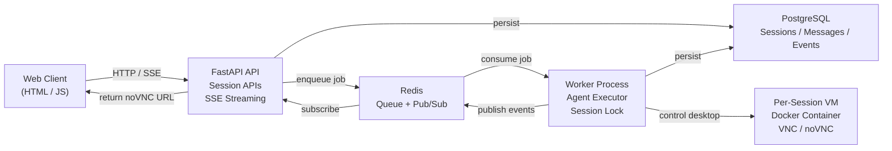

# Computer Use Agent — Scalable Backend & Session Management

> **CONFIDENTIALITY NOTICE**
> This repository contains proprietary information. By accessing it, you agree to NDA terms.
> Unauthorized use, disclosure, or distribution is prohibited.
> If you received access in error, notify the owner and delete immediately.

---

## 1. Overview

This project implements a **scalable backend system for managing Computer Use Agent sessions**, inspired by Anthropic’s _computer-use-demo_ and comparable in architecture to tools like **OpenAI Operator**.

The system replaces the original experimental Streamlit UI with a **production-style FastAPI backend**, supporting:

- Multi-session management
- Real-time streaming of agent progress
- Per-session virtual desktops (VNC / noVNC)
- Persistent chat and event history
- Concurrency-safe execution
- Docker-based local development and deployment
- A simple HTML/JS frontend demo

The focus of this project is **backend architecture, correctness, and scalability**, not UI complexity.

---

## 2. Key Features

### Backend Architecture

- Stateless **FastAPI** API layer
- Separate **worker process** for agent execution
- Redis-based **job queue** and **Pub/Sub**
- PostgreSQL persistence
- Per-session locking to prevent race conditions

### Real-Time Streaming

- **Server-Sent Events (SSE)** for progress updates
- Live streaming of:

  - status changes
  - tokens
  - tool calls
  - screenshots
  - logs
  - assistant messages

### Session-Based Virtual Desktops

- One **Docker container per session**
- Desktop exposed via:

  - VNC
  - noVNC (browser-based)

- Containers started/stopped automatically per session lifecycle

### Persistence

- All sessions, messages, and events stored in PostgreSQL
- Session recovery supported after browser refresh

### Demo Frontend

- Pure HTML + JavaScript
- No framework dependencies
- Shows:

  - noVNC desktop
  - live SSE events
  - chat history
  - session status badge
  - last error (on failure)

### Optional API authentication

The backend supports optional API key protection.

If the `API_KEY` environment variable is set, all write endpoints
(e.g. create session, send message, stop session) require the header:

```http
X-API-Key: <your-api-key>
```

---

## 3. Repository Structure

```text
computer-use-backend/
├── app/                     # Application code (owned)
│   ├── api/                 # FastAPI routes
│   ├── core/                # DB, Redis, queue, locks, config
│   ├── agent_engine/        # Agent adapters (mock + real)
│   ├── session_runner/      # Per-session VM/container runner
│   ├── worker/              # Background worker
│   └── main.py              # FastAPI entrypoint
│
├── vendor/                  # Vendored third-party code (read-only)
│   └── computer_use_demo/   # Copied from anthropic-quickstarts
│
├── frontend/                # Demo HTML/JS UI
│   └── index.html
│
├── migrations/              # Database migrations
├── docker/                  # Dockerfiles
├── docker-compose.yml
├── pyproject.toml
└── README.md
```

---

## 4. Architecture Overview

### Services

| Component         | Responsibility                            |
| ----------------- | ----------------------------------------- |
| **API (FastAPI)** | Session CRUD, SSE streaming, VNC metadata |
| **Worker**        | Executes agent turns, emits events        |
| **Redis**         | Job queue + Pub/Sub for streaming         |
| **Postgres**      | Persistent storage                        |
| **Session VM**    | Isolated desktop per session              |

### High-Level Flow

1. Client creates a session (`POST /v1/sessions`)
2. Backend:

   - Creates DB session
   - Starts a dedicated desktop container

3. Client connects to:

   - SSE stream
   - noVNC iframe

4. Client sends instruction (`POST /messages`)
5. Worker:

   - Acquires session lock
   - Runs agent turn
   - Streams progress events
   - Saves messages/events

6. Session returns to idle or failed state

### High-Level Architecture



---

## 5. Concurrency & Race Condition Handling

### Problem

Multiple user requests to the **same session** must not execute concurrently.

### Solution

- Each session has a **Redis-based lock**
- Only **one worker** can process a session at a time
- If a session is:

  - `running` or `queued` → UI disables Send
  - locked → backend serializes execution

This guarantees:

- No overlapping agent runs
- Predictable state transitions
- Safe concurrent sessions across users

---

## 6. Real-Time Streaming (SSE)

### Endpoint

```

GET /v1/sessions/{session_id}/events

```

### Characteristics

- Uses **Server-Sent Events**
- Backed by Redis Pub/Sub
- Includes DB backlog on reconnect

### Event Types

| Type         | Description                                |
| ------------ | ------------------------------------------ |
| `status`     | idle / queued / running / failed / stopped |
| `token`      | Partial model output                       |
| `tool_call`  | Computer tool actions                      |
| `screenshot` | Desktop screenshots                        |
| `log`        | Internal logs                              |
| `message`    | Final assistant message                    |

---

## 7. Agent Execution Modes

### Mock Mode (Default)

- No external API keys required
- Simulates:

  - thinking
  - tool usage
  - streaming tokens

- Used for:

  - local development
  - CI
  - reviewer evaluation

### Anthropic Mode (Optional)

- Integrates real computer-use agent
- Uses vendored `computer-use-demo` stack
- Enabled via environment variables

```env
AGENT_MODE=anthropic
ANTHROPIC_API_KEY=...
ANTHROPIC_MODEL=claude-3-5-sonnet-latest
```

---

## 8. API Endpoints

### Sessions

| Method | Path                     | Description               |
| ------ | ------------------------ | ------------------------- |
| POST   | `/v1/sessions`           | Create session + start VM |
| GET    | `/v1/sessions`           | List sessions             |
| GET    | `/v1/sessions/{id}`      | Get session metadata      |
| POST   | `/v1/sessions/{id}/stop` | Stop session + remove VM  |

### Messages

| Method | Path                         | Description           |
| ------ | ---------------------------- | --------------------- |
| POST   | `/v1/sessions/{id}/messages` | Send user instruction |

### Streaming

| Method | Path                       | Description |
| ------ | -------------------------- | ----------- |
| GET    | `/v1/sessions/{id}/events` | SSE stream  |

### History

| Method | Path                        | Description  |
| ------ | --------------------------- | ------------ |
| GET    | `/v1/sessions/{id}/history` | Chat history |

---

## 9. Demo Frontend

### Access

```
http://localhost:8000/
```

### Features

- Create / stop / clear sessions
- noVNC desktop embedded
- Live SSE logs
- Chat history
- Status badge
- Error display
- Auto-reconnect via localStorage
- Reviewer-friendly curl commands

---

## 10. Local Development

### Requirements

- Docker
- Docker Compose

### Start Everything

```bash
docker compose up --build
```

### Verify

- API health: [http://localhost:8000/health](http://localhost:8000/health)
- Demo UI: [http://localhost:8000/](http://localhost:8000/)

---

## 11. Vendored Code Notice

The directory:

```
vendor/computer_use_demo
```

contains code copied directly from **Anthropic’s computer-use-demo** repository.

- Treated as **read-only**
- Integrated via a thin adapter layer
- Preserved to demonstrate reuse of the original stack

---

## 12. Security Notes

- Optional API key protection supported
- Session containers isolated
- No secrets committed to repository
- Mock mode avoids external dependencies

---

## 13. Final Notes

This project intentionally prioritizes **robust backend engineering** over UI polish.
The architecture is extensible to:

- Kubernetes
- Multiple workers
- Auth providers
- Production monitoring
